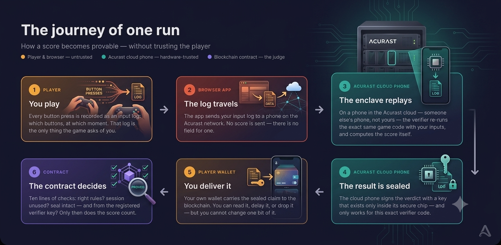

# A New Polkadot Product (Devnet) Capability: a Phone as the Backend Server

*A browser game with no company servers — distributed by a chain, verified by a
smartphone's secure hardware in the Acurast cloud, and audited by a smart contract.
This is the true story of how it was built, and why the game is the least important
part of it.*

---

## The score that can't lie

There is a small platformer game called Rainbow. You play it in a browser: run, jump,
finish. When your run ends, a number lands on a public leaderboard.

Here is the claim that makes it interesting: **nobody can fake that number.** Not the
player, with all the developer tools in the world open. Not the developer. Not a
hosting company — there isn't one. The number is true not because someone respectable
checks it, but because a smartphone in the Acurast cloud re-ran the entire game inside
its secure hardware and put an unforgeable signature on the result.

The developers are blunt about the game itself. Their own documentation says: *"the
game is a strawman."* It exists to make something invisible visible. The real
proof-of-concept is the backend — or rather, the fact that there barely is one: an app
distributed by a blockchain, computed for by a phone, judged by a contract. This
article is about that capability, demonstrated today on the Polkadot Product devnet
together with Acurast.

Four actors, and no company: the player (trusted with nothing), the app (served by a
chain, not a server), the Acurast cloud phone (someone else's phone — never the
player's — whose secure chip does the verifying), and a small contract that acts as
the judge. Everything that follows is these four talking to each other.

## An app with no server

Rainbow is a **Polkadot Product**. If you have never heard the term: it is an app
whose files are published *onto a blockchain* — the Bulletin chain — under a
human-readable name, in this case `rainbow-dev.dot`. When you open it inside the
Polkadot app, your device fetches those files from the chain's own network and runs
them in a locked sandbox. There is no web server, no CDN contract, no company machine
that could go down or quietly swap the code.

The sandbox is strict in an unusual direction: the app **holds no keys and opens no
connections of its own**. Signing and blockchain access are *lent* to it by the host —
the Polkadot app — and the user approves what crosses that line. Rainbow's build even
greps its own compiled bundle to prove no wallet library or direct chain connection
snuck in.

One more surprise for developers: the name is not a label. The app's on-chain account
is mathematically derived from the string `rainbow-dev.dot`. Rename the app and you
have created a different identity — a fact the team learned the hard way, and worth an
article of its own.

The capability, in one sentence: **you can ship an app that no company hosts, and
whose wallet access is controlled by the user's own host — today, on the devnet.**

## The cloud in a drawer

The second ingredient is **Acurast**, and it answers the question the first ingredient
raises: if there's no server, who does the computing that can't happen in an untrusted
browser?

Answer: smartphones. Acurast is a decentralized compute network whose nodes are
ordinary phones — over 250,000 compute units at the time of writing. The pitch is
counterintuitive but well-founded: about 1.39 billion smartphones are sold every year,
each carrying dedicated security hardware that most servers never get. A phone you no
longer use can be factory-reset, locked down, and enrolled as a *processor* — a
compute node that earns by running other people's workloads.

The crucial difference from a normal cloud: Acurast is built so the network can
**prove what ran**. Most clouds ask you to trust them. This one shows receipts.

One clarification, because it trips everyone: the phone doing Rainbow's verification
is **not the player's phone**. It is someone else's device in the Acurast cloud,
selected by the network, whose owner has no way to see or touch the work it does. Your
phone plays the game; a stranger's phone — one neither of you controls — checks it.

## The vault inside the phone

Why would anyone trust a stranger's phone? Because of three properties of its secure
hardware, each one documented by Acurast and grounded in decades of security research.

**A key is born in silicon.** The phone's secure element — a dedicated security chip,
physically separate from the main processor (Google's Titan M2 class of coprocessor,
in Acurast's current implementation) — generates a signing key *inside itself*. The
key never leaves. Not to the app, not to Acurast, not to the phone's owner. This is
the textbook definition of a trusted execution environment [1], and "the private key
remains in the dedicated secure element" is Acurast's own phrasing [2].

**The key is welded to the code.** Acurast's whitepaper states it precisely: each
deployment receives its own key pair *linked to the code of the deployment itself* —
"if the code is changed, access to the key pair is lost forever" [2]. Rainbow's team
measured this in practice: redeploying byte-identical code kept the same key; changing
one byte — even a comment — rotated it. The consequence is powerful: a valid signature
from that key is proof that *this exact verifier program* produced the result. Not a
modified version. Not a lookalike.

**The factory vouches for the chip.** Before the Acurast chain matches any job to a
device, the device submits an attestation — a certificate chain leading back to the
chip's manufacturer (Google, for Titan-class hardware) — proving it is genuine secure
hardware running genuine software [2][3]. The chain stores these attestations and
honors revocations. This is *remote attestation*, a mechanism security researchers
formalized years before blockchains existed [4][5].

Stack the three together and you get the sentence the whole system rests on: **one
valid signature proves that this exact code, on genuine secure hardware, produced this
exact result.**

## Assembling the machine

Now the pieces snap together — and one clever trick makes a *game* verifiable at all.

Rainbow's game engine is a **deterministic machine**. Same starting seed, same button
presses, same result — always, on any computer. That sounds obvious and is not: normal
game code drifts across machines because of floating-point math. Rainbow's simulation
uses fixed-point arithmetic only, and the team verified determinism the brutal way:
they ran the same compiled module on three different engines — native, the phone's
runtime, and the browser's — and compared *every single tick*: millions of ticks,
hundreds of seeds, identical every time.

Because the game is deterministic, the browser never needs to be trusted:

- While you play, the app records only **which buttons you pressed, and when**. That
  input log is the whole story of your run.
- When the run ends, the log is sent to the verifier on the Acurast cloud phone. **No
  score is sent.** The API literally has no field for one — the strongest possible
  answer to "what if the client lies about its score?"
- Inside the phone, the verifier **replays your inputs against the exact same
  compiled game code** and computes the score itself.
- And the rules can't be swapped: the leaderboard contract stores a fingerprint
  (a keccak-256 hash) of the exact game binary, and the verifier fingerprints
  whatever binary it actually loaded. The two must match, or nothing counts.

This "replay the client's inputs and check them" idea has a direct academic pedigree:
researchers proposed verifying game clients by replaying their action logs at NDSS in
2010 [6], and using trusted hardware for game anti-cheat was demonstrated at ACM CCS
in 2020 [7]. Rainbow combines both — and anchors them to a public blockchain.

## The sealed envelope

There is one subtle, beautiful piece left: **the player delivers the proof.**

The verifier does not talk to the leaderboard. Instead, it hands the result back to
the least trusted actor in the whole system — you. What it hands over works like a
sealed envelope. Inside: who played, which game, which session, what score, which
rules, and an expiry time. The seal is a digital signature over every one of those
fields at once, in a format (EIP-712 [8]) that also binds the signature to *one
specific contract on one specific chain* — it cannot be replayed anywhere else.

You can read the envelope. You can sit on it. You can throw it away. What you cannot
do is change a single bit without breaking the seal.

When your wallet submits it, the contract runs a checklist a human can follow: Has it
expired? Is the session number within the allowed budget (twelve per hour — scores
mean something because grinding is capped)? Has this session been used before — each
one can be spent exactly once? Do the rules match the pinned fingerprint? And finally:
recover the signer's address from the signature [9][10] — is it the verifier key
registered for this game? That registered key was read from the Acurast chain's public
record of the deployment, published *before the job ever ran*.

Edit the log, and the replay computes the score your edited inputs actually earn.
Forge the seal, and the recovered signer isn't the registered verifier. Replay an old
win, and the session is already spent. Three different cheats hit three different
walls.

Could the same guarantees come from pure cryptography — zero-knowledge proofs —
instead of secure hardware? In principle, yes [11][12]. In practice, proving a
60-frames-per-second game run in zero knowledge is enormously expensive, while
replaying it inside a hardware-attested enclave costs about what the game cost to run
the first time. The phone-based approach is the pragmatic point in the design space —
that's the engineering judgment this project set out to demonstrate.

## Not a game — a pattern

Strip away the platformer and look at what was actually proven possible:

*A client records an activity. A phone in the Acurast cloud deterministically re-runs
it, computes the true outcome, and signs it with a key welded to its code and its
hardware. Any EVM-compatible contract verifies that signature in ten lines.*

Nothing in that sentence says "game". The verifier is a few hundred lines of
game-agnostic code plus one swappable module; the contract already supports multiple
games, each pinned to its own rules fingerprint. Swap the module and the same backbone
verifies: sensor readings you can't fake, exam results that prove themselves, fair
draws whose seeds nobody can pick, AI outputs that carry receipts of which model and
input produced them.

The game is the demo. The capability — trustless distribution from the Polkadot
Product devnet, plus provable computation from Acurast phones — is the product.

## What this doesn't prove yet

Honesty is the whole point of this system, so it applies to the article too.

- **One verifier, chosen by the developer.** Today a single Acurast cloud phone,
  whitelisted by the team, does the verifying. Decentralized compute, not yet
  decentralized *verification* — scaling to many independent verifiers is
  configuration and registration work, but it hasn't been demonstrated here.
- **The tunnel can censor, not forge.** The phone is reachable through a tunnel
  provider (any provider works; nothing in the design depends on which). Whoever
  runs the tunnel could delay or block traffic. They could not alter a result
  without breaking the seal.
- **One owner key registers verifiers.** The contract's owner — a single account —
  decides which verifier keys count. That's an honest single point of compromise in
  the current deployment.
- **It proves the rules were followed — not who was playing.** A bot, a
  tool-assisted superhuman run, or one person with many accounts are all outside
  what this system defends against, by design.
- **Secure hardware is strong, not magic.** TEEs have had real vulnerabilities, and
  the research community documents them systematically [13]. The trust chain
  ultimately inherits from the chip vendor.
- **It's a devnet.** Small numbers, test data alongside real runs, and every claim
  in this article checkable against a public chain — which is exactly how a
  proof-of-concept should live.

## Want the details?

Everything here is verifiable: the code, the deployment records, the on-chain
contract, and the determinism harness live in the open repository
(**TODO: repo URL**), including the documents this article quotes. The proof methods
stand on published research — the full reference list is below.

---

### References

1. Sabt, Achemlal, Bouabdallah — *Trusted Execution Environment: What It Is, and What
   It Is Not*, IEEE TrustCom 2015.
2. Killer, De Carli, Brun, Charlé, Godenzi, Wehrli — *Acurast: Decentralized
   Serverless Cloud*, arXiv:2503.15654 (v2, Jan 2026).
3. Acurast pallet documentation — `submitAttestation` / attestation certificate
   chains: github.com/Acurast/acurast-core.
4. Coker, Guttman, Loscocco et al. — *Principles of Remote Attestation*,
   International Journal of Information Security, 2011.
5. Ménétrey et al. — *Attestation Mechanisms for Trusted Execution Environments
   Demystified*, DAIS 2022.
6. Bethea, Cochran, Reiter — *Server-side Verification of Client Behavior in Online
   Games*, NDSS 2010.
7. Park, Ahmad, Lee — *BlackMirror: Preventing Wallhacks in 3D Online FPS Games*,
   ACM CCS 2020.
8. EIP-712 — *Typed structured data hashing and signing*,
   eips.ethereum.org/EIPS/eip-712.
9. Johnson, Menezes, Vanstone — *The Elliptic Curve Digital Signature Algorithm
   (ECDSA)*, IJIS 2001.
10. Certicom Research — *SEC 2: Recommended Elliptic Curve Domain Parameters* (the
    secp256k1 curve), 2010.
11. Walfish, Blumberg — *Verifying computations without reexecuting them*,
    Communications of the ACM, 2015.
12. Ben-Sasson, Chiesa, Tromer, Virza — *Succinct Non-Interactive Zero Knowledge for
    a von Neumann Architecture*, USENIX Security 2014.
13. Cerdeira, Santos, Fonseca, Pinto — *SoK: Understanding the Prevailing Security
    Vulnerabilities in TrustZone-assisted TEE Systems*, IEEE S&P 2020.

*Additional background: Schneier & Kelsey on tamper-evident audit logs (ACM TISSEC
1999); Crosby & Wallach on tamper-evident logging (USENIX Security 2009); Android Key
Attestation documentation (developer.android.com); Acurast documentation
(docs.acurast.com).*
