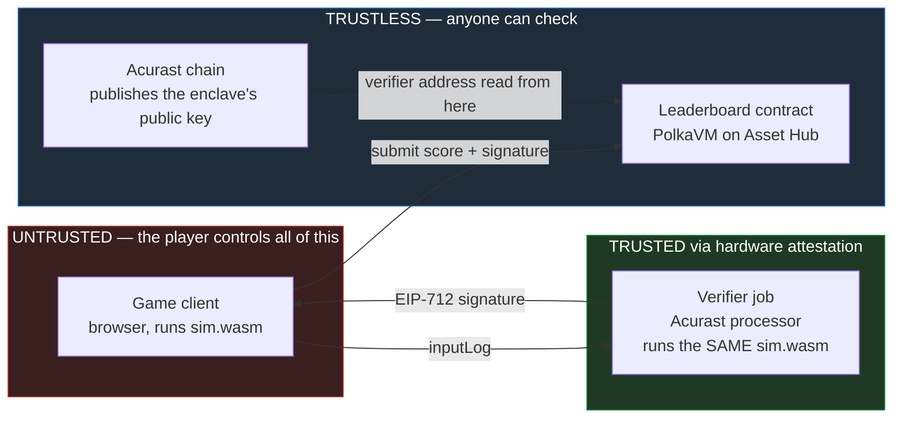
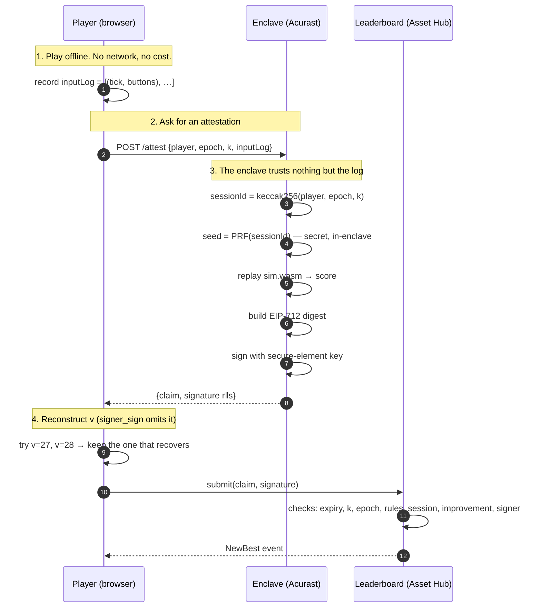
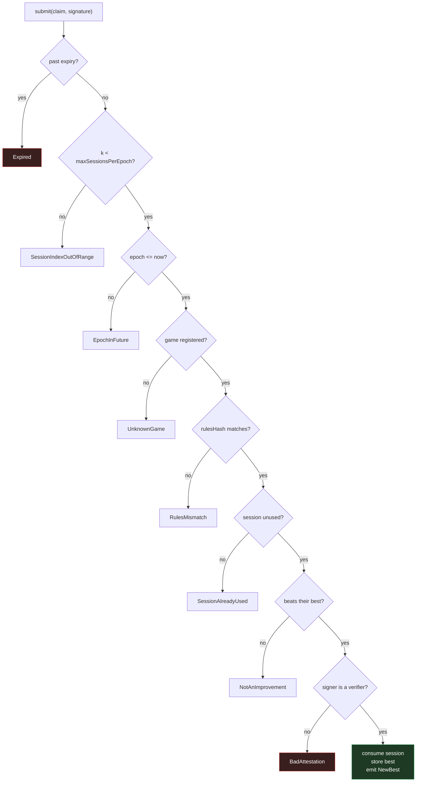
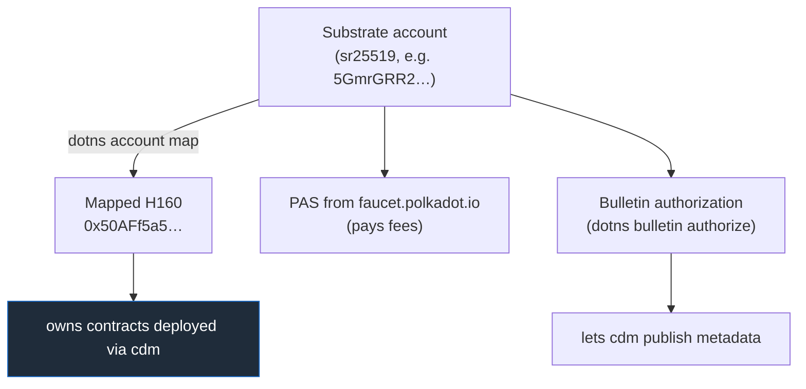
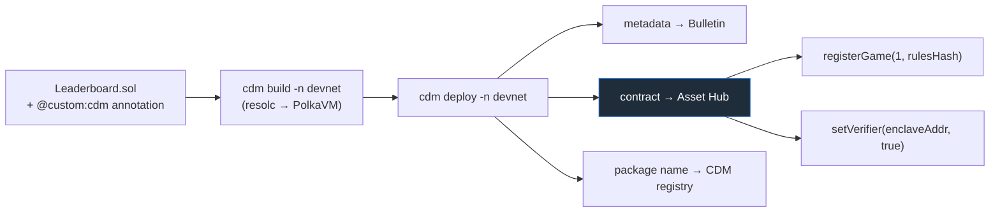
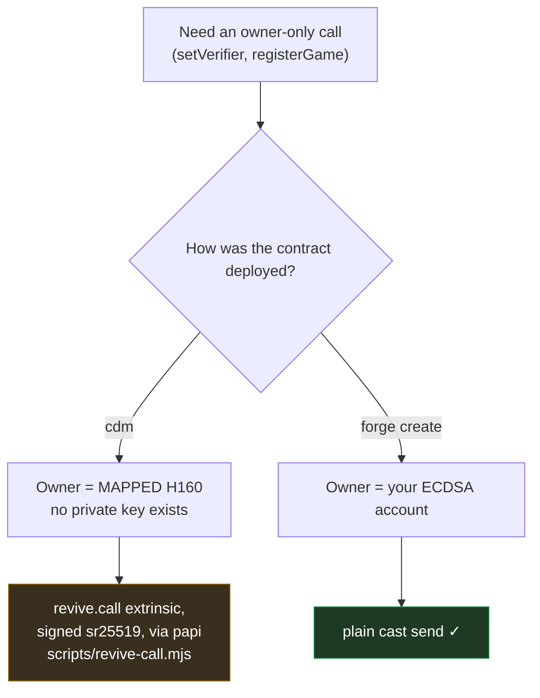
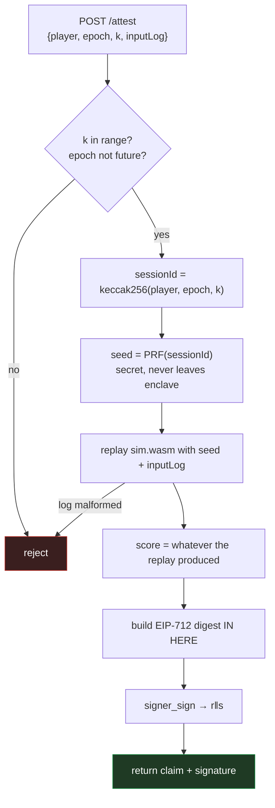
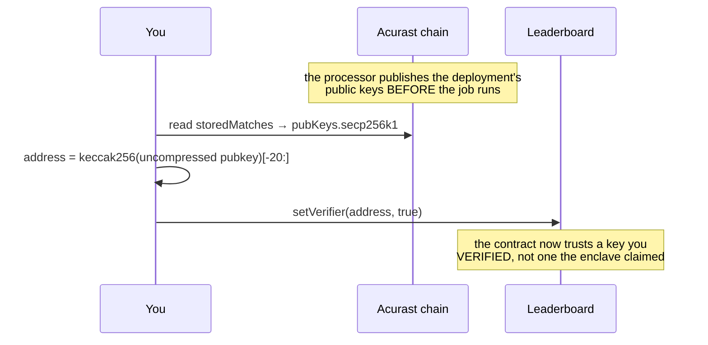
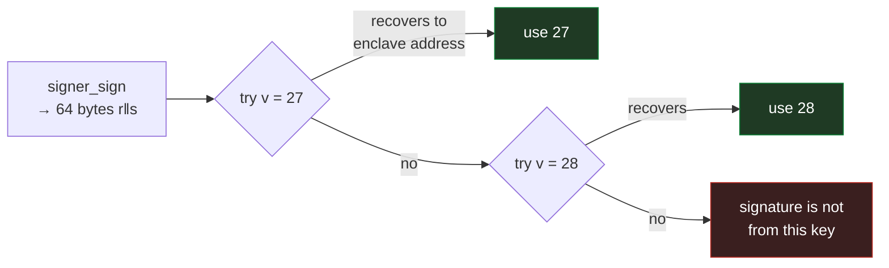

# Rainbow — Developer Guide

How to build, deploy and operate a leaderboard where scores are **proven**, not claimed.

Everything here has been run end-to-end against live infrastructure. Where something is
untested or unsolved, it says so.

---

## 1. The problem, in one paragraph

A wallet signature proves **who signed**, never **what is true**. If a player signs
`score = 999999`, the signature is perfectly valid and the claim is a lie. So a leaderboard
needs an authority over score computation that the player does not control.

Rainbow puts that authority inside a **TEE** (Trusted Execution Environment) — a secure
enclave on an Acurast processor, which is a physical Android phone. The enclave re-plays the
player's own keypresses against the exact same game code, works out the score itself, and
signs the result with a key that never leaves the phone's secure element.

The player is never trusted. Only their **input log** is accepted, and even that is replayed
rather than believed.

---

## 2. The shape of the system



**One simulation, not two.** The client and the enclave run the *same compiled
`sim.wasm`*. Two hand-written implementations would drift on rounding or iteration order and
start flagging honest players as cheats.

---

## 3. Who you have to trust

| Component | Trust | Why |
|---|---|---|
| Game client | **none** | Fully attacker-controlled. Assume it is modified. |
| Input log | **none** | Accepted as data, then replayed. Never believed. |
| Verifier enclave | hardware | Key lives in the phone's secure element. Its **public key is published on-chain** before the job runs, so you verify rather than trust the operator. |
| Cloudflare tunnel | **liveness only** | It carries bytes. It cannot forge a signature made inside the secure element — it can only stall or censor. |
| `setVerifier` owner | **full** | The single point of compromise. Put it behind a multisig for anything beyond a demo. |

---

## 4. The end-to-end flow



**Playing is free.** Cost is paid per *claim*, not per minute played — a ten-minute run is
~36,000 ticks that compresses to a few kilobytes, because the log records only input
*changes*, not frames.

---

## 5. What the contract actually checks

Order matters: the cheap structural checks run **before** the expensive signature recovery,
so a malformed submission is rejected cheaply.



> **Watch this ordering when writing tests.** A tamper test aimed at an already-spent session
> returns `SessionAlreadyUsed` and never reaches the signature check — so it proves nothing.
> Always aim signature tests at a **fresh** session.

### Two design decisions worth understanding

**Anti-grinding (why `epoch` and `k` exist).** A player could otherwise ask for session after
session, sample each seed for a few seconds, throw away the bad ones and only finish the
lucky ones. So a session identifier is **derived, never claimed**:

```
sessionId = keccak256(player, epoch, k)
epoch     = block.timestamp / 3600      (one hour)
k         ∈ [0, 12)                     (12 slots per hour)
```

Because it is derived, a malformed session identifier cannot exist. The contract enforces
`k < 12` and `epoch <= now` **on-chain**, so the re-roll cap is auditable rather than
something the enclave polices on its own honour. The *seed* stays secret inside the enclave,
so a player still cannot compute seeds offline and shop for a good one.

**Rules pinning (why `rulesHash` exists).** Each game registers a `rulesHash` **once**, and
it is `keccak256(sim.wasm)` — the hash of the exact simulation binary. Upgrading the game
means a **new `gameId`**, not a mutated hash. Otherwise scores earned under old rules would
sit on the same board as scores earned under new ones, silently incomparable.

---

## 6. Setup

### 6.1 Toolchain

```bash
node --version      # 22+ required by pad/cdm
rustup target add wasm32-unknown-unknown
npm i -g @acurast/cli @polkadot-community-foundation/cdm-cli
cdm setup           # installs the Rust/PVM toolchain; npm does NOT
```

> **Two Foundry builds, and you may need both.**
>
> - **Upstream Foundry** (`curl -L https://foundry.paradigm.xyz | bash`) — for `forge test`,
>   `cast`, and `forge create`. This is the [official Polkadot docs](https://docs.polkadot.com/smart-contracts/dev-environments/foundry/) path.
> - **foundry-polkadot** — only if you deploy with `cdm`, because `cdm` shells out to
>   `forge build --resolc`, a flag upstream does not have.
>
> Its installer **overwrites** `~/.foundry/bin/forge`. Install it isolated instead:
>
> ```bash
> export FOUNDRY_DIR="$HOME/.foundry-polkadot"
> mkdir -p "$FOUNDRY_DIR/bin"
> curl -sSfL https://raw.githubusercontent.com/paritytech/foundry-polkadot/master/foundryup/foundryup \
>   -o "$FOUNDRY_DIR/bin/foundryup-polkadot" && chmod +x "$FOUNDRY_DIR/bin/foundryup-polkadot"
> FOUNDRY_DIR="$FOUNDRY_DIR" "$FOUNDRY_DIR/bin/foundryup-polkadot"
>
> # then, ONLY for cdm builds:
> export PATH="$HOME/.foundry-polkadot/bin:$PATH"
> ```

### 6.2 Accounts

You need **three** distinct things funded/authorised, and they trip people up because they
are separate:



> **A mapped H160 has no private key.** It is derived from your Substrate account. So
> `cast send --mnemonic` will *not* work for owner-only calls on a `cdm`-deployed contract —
> cast derives an Ethereum BIP44 key and signs as a completely different address. See §9.

---

## 7. Part 1 — the simulation

The whole guarantee rests on the sim replaying **identically** everywhere. If the browser and
the enclave disagree by one point, an honest player is flagged as a cheat with no error
anywhere.

```bash
cargo test -p sim                                          # 27 tests
cargo build -p sim-wasm --release --target wasm32-unknown-unknown
cargo run  -p replay --release -- compare --seeds 512      # native vs wasmi
cargo run  -p replay --release -- export  --seeds 48
node harness/run-node.mjs                                  # wasmi vs V8
cargo run  -p replay --release -- selftest                 # NEGATIVE CONTROL
```

Rules that make this work, enforced structurally rather than by convention:

| Rule | How it is enforced |
|---|---|
| No I/O, no wall-clock, no `HashMap` | `#![no_std]` — they are unreachable |
| No floating point | fixed-point 16.16 throughout |
| Pinned RNG | PCG32 written **in-tree**, no `rand` dependency |
| No pointer-width-dependent state | no `usize` in `State`, asserted by a test |
| Fixed timestep | `step()` takes no delta — the tick count *is* the clock |

> **Why not `rand::SmallRng`?** It is explicitly not reproducible across versions, and has
> historically picked a different algorithm by pointer width — exactly the wasm32 (32-bit)
> versus aarch64 (64-bit) split this system spans.

> **Always run `selftest`.** A harness that only ever prints PASS looks identical whether it
> is checking carefully or not checking at all. `selftest` injects a known one-bit fault and
> asserts the detector finds it, at the right tick.

---

## 8. Part 2 — the contract

### 8.1 Test

```bash
cd contracts
forge install OpenZeppelin/openzeppelin-contracts@v5.4.0 --no-git
forge install foundry-rs/forge-std@v1.11.0 --no-git
forge test          # 34 tests, every reject path
```

### 8.2 Deploy



The CDM package name comes from a NatSpec annotation on the contract itself:

```solidity
/// @custom:cdm @dw3labs/rainbow-leaderboard
contract Leaderboard is EIP712, Ownable { … }
```

```bash
export PATH="$HOME/.foundry-polkadot/bin:$PATH"
cd contracts
cdm build  -n devnet
cdm deploy -n devnet --bulletin-url wss://bulletin-paseo-02.tservices.es:9443
```

> **`cdm deploy` passes NO constructor arguments.** A contract with a non-empty constructor
> receives nothing and reverts with `Revive.ContractReverted`. Design for a **zero-argument
> constructor** plus owner-only setters — and validate anyway, so a misconfiguration is a
> clean revert instead of a permanently broken contract.

> **Package names are permanent and global.** The registry is append-only. And `cdm` with no
> configured account signs as **Alice, silently** — the name is then hers forever. Check
> `~/.cdm/accounts.json` before your first deploy.

> **Bulletin publish can time out** at 300s. That is usually the endpoint, not your
> authorization — check with `dotns bulletin status <ss58> --env devnet` and retry with a
> different `--bulletin-url`. Note the contract deploys *before* metadata, so a timeout can
> orphan a deployed-but-unregistered contract.

### 8.3 Configure

`rulesHash` is the hash of the simulation binary itself:

```bash
RULES=$(node -e '
  const {keccak_256}=require("@noble/hashes/sha3.js");
  const b=require("fs").readFileSync("target/wasm32-unknown-unknown/release/sim_wasm.wasm");
  console.log("0x"+Buffer.from(keccak_256(b)).toString("hex"))')

node scripts/revive-call.mjs --to $CONTRACT \
  --data "$(cast calldata 'registerGame(uint64,bytes32)' 1 $RULES)"
```

---

## 9. Owner calls — the part that surprises everyone



```bash
# reads work with any Ethereum JSON-RPC client
cast call $CONTRACT "best(uint64,address)(uint64)" 1 0xPLAYER \
  --rpc-url https://paseo-assethub-rpc.laissez-faire.trade

# owner writes on a cdm-deployed contract
node scripts/revive-call.mjs --to $CONTRACT \
  --data "$(cast calldata 'setVerifier(address,bool)' 0xVERIFIER true)"
```

> **`@polkadot/api` cannot sign for this chain.** It builds extrinsic version 4; Asset Hub
> Paseo expects newer, and the runtime *panics while decoding* —
> `wasm 'unreachable' instruction executed` inside `TaggedTransactionQueue_validate_transaction`.
> It reads like a bad contract call, but it **reproduces on `system.remark`**, which is what
> proves it is the client. Use **polkadot-api (papi)**, as `dotns` does.

---

## 10. Part 3 — the verifier enclave

The verifier is a small Node job that bundles `sim.wasm` and a vendored keccak256 — 52 KB
total, comfortably under the ~1 MB IPFS ceiling for an Acurast bundle.



**Four rules the enclave must never break:**

1. **No score is accepted.** `/attest` has no score field at all — it can only be computed.
2. **The digest is built inside.** Signing a caller-supplied digest would let anyone get
   anything signed.
3. **`rulesHash` is computed from the loaded artifact**, not configured, so the enclave
   cannot attest for a ruleset it is not running.
4. **The seed never leaves.** `seed = keccak256(signer_sign("rainbow-seed-v1" ‖ sessionId))`.
   `signer_sign` is deterministic (RFC 6979) and its key is in the secure element, so this
   is a PRF the player cannot evaluate offline.

### Deploy it

```bash
cd e2e/acurast-verifier
# .env: ACURAST_MNEMONIC, CONTRACT, CHAIN_ID, GAME_ID, WEBHOOK_URL
acurast estimate-fee rainbow-verifier    # validates config BEFORE spending
acurast deploy rainbow-verifier
```

Key config, and why:

```jsonc
"runtime": "Shell",                     // Node.js runtime CANNOT do EIP-712 — see below
"assignmentStrategy": {
  "type": "Single",                     // "Competing" rotates processors → rotates keys
  "instantMatch": [{"processor": "<SS58>", "maxAllowedStartDelayInMs": 10000}]
},
"usageLimit": {"maxMemory": 2000, "maxNetworkRequests": 10, "maxStorage": 10000},
"mutability": "Mutable"                 // required if you later use reuseKeysFrom
```

> **The runtime choice is load-bearing.** On the **Node.js** runtime,
> `_STD_.chains.ethereum.signer.sign` force-prepends `"acusig" ‖ SCRIPT_HASH` before hashing,
> so an EIP-712 digest could never be recovered by the contract. The **Shell/Cargo** runtime's
> `signer_sign` signs the bytes you give it, with no envelope. Use `Shell`.

> **`usageLimit` is a requirement, not a cap.** It is matched against what the processor
> *advertises*; ask for more than the device offers and it becomes ineligible. And the units
> are not bytes — `networkRequestQuota` is a `u8`, so it is a *count*. Check the device's
> advertised values first.

> **`instantMatch` skips the lottery.** Without it you are competing for public processors,
> which is what strands most first deployments at "finding the processor". It also skips the
> ~4.5 h warmup for a freshly onboarded device.

---

## 11. Part 4 — wiring them together

This is the step that makes the trust story real.



```bash
# 1. read the enclave's key from Acurast chain state (not from the enclave!)
#    acurastMarketplace.storedMatches → assignment.pubKeys.secp256k1

# 2. register it
node scripts/revive-call.mjs --to $CONTRACT \
  --data "$(cast calldata 'setVerifier(address,bool)' 0xafbd70f7… true)"

# 3. run the whole flow
node scripts/attest-and-submit.mjs \
  --verifier https://<tunnel> --expect-verifier 0xafbd70f7… --player 0x… --k 0
```

> **Keys are per deployment.** Every redeploy mints a new verifier address unless you use
> `reuseKeysFrom`. Keep `isVerifier` a **set** and *add without removing*, so attestations
> already in flight stay valid until they expire.

---

## 12. Part 5 — the signature detail that will cost you a day

Acurast's `signer_sign` returns **64 bytes** (`r‖s`) with **no recovery id**.
`ECDSA.recover` needs **65** with `v ∈ {27, 28}`.



```js
for (const rec of [0, 1]) {
  const packed = new Uint8Array(65);
  packed[0] = rec; packed.set(rs, 1);
  const pub = secp256k1.recoverPublicKey(packed, digest, {prehash: false});
  if (addressOf(pub) === enclaveAddress) { v = 27 + rec; break; }
}
```

Use the contract's `scoreDigest(claim)` as the **single source of truth** for what to sign.
Do not reimplement the EIP-712 encoding on the job side and hope it matches — verify it does,
before deploying:

```bash
# enclave's digest, computed locally against a mock bridge
# vs the deployed contract's:
cast call $CONTRACT "scoreDigest((address,uint64,uint64,uint64,uint32,bytes32,uint64))(bytes32)" \
  "($PLAYER,1,$SCORE,$EPOCH,$K,$RULES,$EXPIRY)" --rpc-url $RPC
```

---

## 13. Live reference

| | |
|---|---|
| Contract | `0x9cc62a70E0d2ed75432C3d9c1F997a122eE976a0` |
| CDM package | `@dw3labs/rainbow-leaderboard` |
| Chain | Paseo Asset Hub, EVM chain id `420420417` |
| ETH-RPC (reads) | `https://paseo-assethub-rpc.laissez-faire.trade` |
| Substrate RPC (writes) | `wss://asset-hub-paseo-rpc.n.dwellir.com` |
| Owner | `0x50AFf5a51BE03d5914D9b5A42c548Dc35A73f7D8` |
| `epochSeconds` / `maxSessionsPerEpoch` | 3600 / 12 |
| Game 1 `rulesHash` | `0x229be8b7…bd479c` = `keccak256(sim.wasm)` |
| `sim.wasm` | 22,820 bytes, `sha256 c56a68b3…e0b5` |

---

## 14. Troubleshooting

| Symptom | Cause |
|---|---|
| `unexpected argument '--resolc'` | upstream Foundry; `cdm` needs foundry-polkadot |
| `Revive.ContractReverted` on deploy | constructor takes arguments; `cdm` passes none |
| `OwnableUnauthorizedAccount(0x…)` | `cast` signing as a BIP44 key, not your mapped H160 |
| `wasm 'unreachable'` in `validate_transaction` | `@polkadot/api` building extrinsic v4 — use papi |
| `Incompatible runtime entry Tx(Revive.call)` | papi field names — `weight_limit`, `dest` as hex string, `data` as `Uint8Array` |
| Acurast job stuck "finding the processor" | no `instantMatch`, or `usageLimit` exceeds what the device advertises |
| Acurast job dies silently | DevTools is **mainnet-only** — a canary job has no stdout. Instrument with a webhook. |
| `apt` exits 100 in the proot | `TMPDIR` leak — `export TMPDIR=/tmp` first |
| `cp X X failed` in the job | the bundle extracts to `/root/app`, which **is** `$HOME/app` |
| Revert `0x36177dda` / `0xdafa9c74` / `0x342bd384` | `SessionAlreadyUsed` / `NotAnImprovement` / `BadAttestation` |

---

## 15. What this does **not** solve

Stated plainly, because a security design that overclaims is worse than one that admits its
edges.

- **Bots and TAS-quality play.** A perfectly executed input log is a *valid* input log.
  Behavioural heuristics inside the enclave are detection, not proof, and an arms race.
- **Sybil.** Nothing stops one human farming many accounts. The Products **personhood
  precompile** is the identified path if the board ever carries value.
- **Hardware attacks on the TEE.** Trust is inherited from the chip vendor's attestation root.
- **Operator device selection.** Using the public processor market instead of your own fleet
  is what removes this.
- **Cloudflare in the path.** Liveness and censorship dependency, not an integrity one.
- **Seed PRF reuses the attestation key.** Domain-separated so it cannot be coerced into
  producing an attestation, but a `derivationPath`-derived key would be cleaner.

**Explicitly not a threat: cherry-picking.** A player choosing which runs to submit is
harmless for a *highest score* board — a withheld run is indistinguishable from a run that
never happened. This would **not** hold for win rates, ELO or tournament records, where the
denominator matters; those need enclave-submitted results rather than player-relayed ones.

---

## 16. The strongest thing still unbuilt

Publish the **input log to Bulletin** alongside each score.

The log fully determines the run, so anyone could re-replay it and check the score
independently. That changes the claim from *"trust the TEE"* to *"the TEE is a fast path over
a publicly re-verifiable record"* — and it comes with ghost replays, spectating and dispute
resolution as side effects.

---

## Further reading

| Document | Contents |
|---|---|
| `docs/E0.2-determinism.md` | cross-target determinism evidence |
| `docs/E0.1-product-sandbox.md` | what a Polkadot Product may do in its sandbox |
| `docs/E0.3-E0.4-acurast.md` | `signer_sign` semantics, tunnel |
| `docs/deployment-devnet.md` | deployment specifics, `cdm` vs `forge create` |
| `docs/end-to-end.md` | the working run, with negative tests |
| `contracts/README.md` | contract design, D1/D3 rationale |
| `Goal.md` | the original design document |
