# Rainbow — Developer Guide

How to build, deploy and operate a leaderboard where scores are **proven**, not claimed.

Everything here has been run end-to-end against live infrastructure. Where something is
untested or unsolved, it says so.

---

## 1. The problem, in one paragraph

A wallet signature proves **who signed**, never **what is true**. If a player signs
`score = 999999`, the signature is perfectly valid and the claim is a lie. So a leaderboard
needs an authority over score computation that the player does not control.

Rainbow puts that authority inside a **TEE** (Trusted Execution Environment) — a secure
enclave on an Acurast processor, which is a physical Android phone. The enclave re-plays the
player's own keypresses against the exact same game code, works out the score itself, and
signs the result with a key that never leaves the phone's secure element.

The player is never trusted. Only their **input log** is accepted, and even that is replayed
rather than believed.

---

## 2. The shape of the system

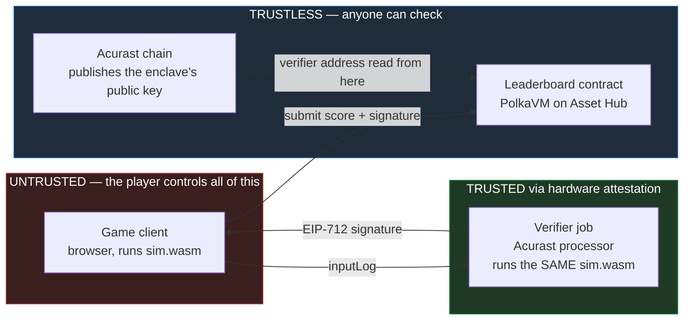

**One simulation, not two.** The client and the enclave run the *same compiled
`sim.wasm`*. Two hand-written implementations would drift on rounding or iteration order and
start flagging honest players as cheats.

---

## 3. Who you have to trust

| Component | Trust | Why |
|---|---|---|
| Game client | **none** | Fully attacker-controlled. Assume it is modified. |
| Input log | **none** | Accepted as data, then replayed. Never believed. |
| Verifier enclave | hardware | Key lives in the phone's secure element. Its **public key is published on-chain** before the job runs, so you verify rather than trust the operator. |
| Cloudflare tunnel | **liveness only** | It carries bytes. It cannot forge a signature made inside the secure element — it can only stall or censor. |
| `setVerifier` owner | **full** | The single point of compromise. Put it behind a multisig for anything beyond a demo. |

---

## 4. The end-to-end flow

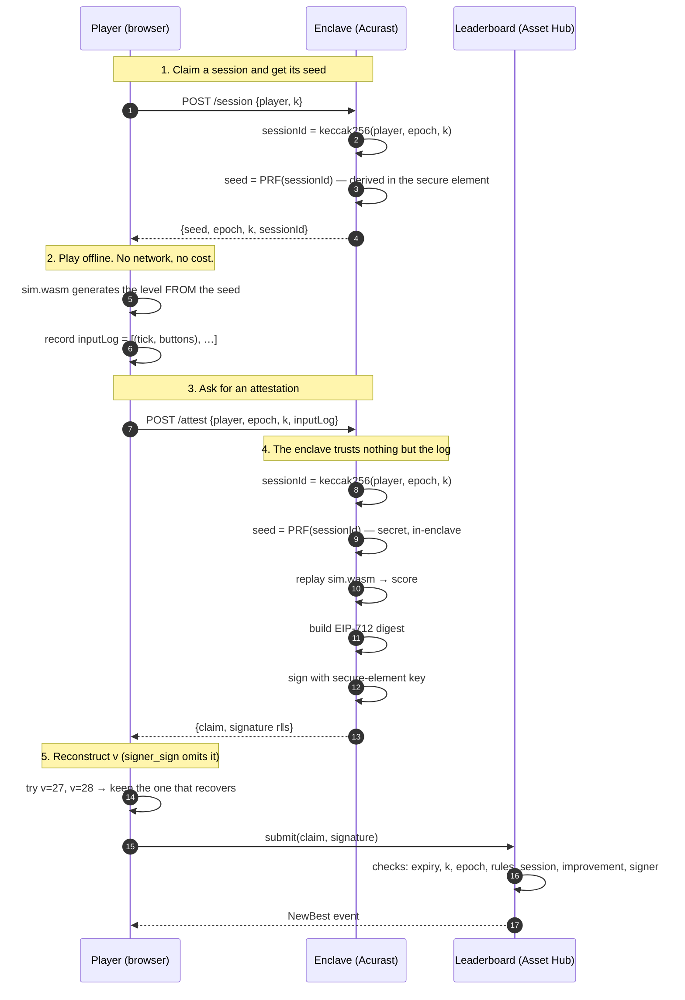

**Playing is free.** Cost is paid per *claim*, not per minute played — a ten-minute run is
~36,000 ticks that compresses to a few kilobytes, because the log records only input
*changes*, not frames.

### Why the seed is handed out at all

The level is *generated from the seed*, so the client cannot draw anything without it —
step 1 is not optional. That is a deliberate trade, and the terms matter:

**Seeds are issued for the current epoch only.** `/attest` and the contract both accept
any epoch `<= current`, because a run played at the end of one epoch may legitimately be
submitted during the next. Issuing *seeds* on those terms would be a different matter: a
player could walk back through every past epoch, harvest twelve seeds from each, sample
them all offline and play only the friendliest one. Restricting issuance to the current
epoch is what holds the cap at `maxSessionsPerEpoch` per hour.

Seeds remain unguessable either way — `deriveSeed` signs inside the secure element, so
knowing one seed says nothing about the next. A player gets the twelve they are entitled
to and must play each to find out what it holds.

> **Known gap.** `/session` is unauthenticated: anyone may request any address's seeds and
> learn which levels that player will face. It consumes nothing (sessions are spent
> on-chain at `submit`, not at issuance) and any resulting score still credits the bound
> player, so it is an information leak rather than a theft. Binding issuance to a wallet
> signature is the obvious hardening and is **not** done here.

---

## 5. What the contract actually checks

Order matters: the cheap structural checks run **before** the expensive signature recovery,
so a malformed submission is rejected cheaply.

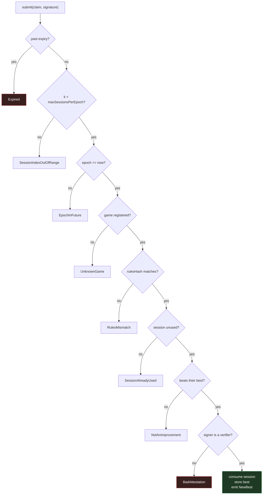

> **Watch this ordering when writing tests.** A tamper test aimed at an already-spent session
> returns `SessionAlreadyUsed` and never reaches the signature check — so it proves nothing.
> Always aim signature tests at a **fresh** session.

### Two design decisions worth understanding

**Anti-grinding (why `epoch` and `k` exist).** A player could otherwise ask for session after
session, sample each seed for a few seconds, throw away the bad ones and only finish the
lucky ones. So a session identifier is **derived, never claimed**:

```
sessionId = keccak256(player, epoch, k)
epoch     = block.timestamp / 3600      (one hour)
k         ∈ [0, 12)                     (12 slots per hour)
```

Because it is derived, a malformed session identifier cannot exist. The contract enforces
`k < 12` and `epoch <= now` **on-chain**, so the re-roll cap is auditable rather than
something the enclave polices on its own honour. The *seed* stays secret inside the enclave,
so a player still cannot compute seeds offline and shop for a good one.

**Rules pinning (why `rulesHash` exists).** Each game registers a `rulesHash` **once**, and
it is `keccak256(sim.wasm)` — the hash of the exact simulation binary. Upgrading the game
means a **new `gameId`**, not a mutated hash. Otherwise scores earned under old rules would
sit on the same board as scores earned under new ones, silently incomparable.

---

## 6. Why the player can safely relay their own score

The browser receives the enclave's attestation and sends the `submit` transaction **itself**.
No relay server, no allowlisted sender — `Leaderboard.submit` is `external` and callable by
anyone, with anything.

That looks like the hole in the design. It is not, and the reason is worth being precise
about, because "the player carries the proof" is exactly the property that makes the system
gasless-capable, censorship-resistant and cheap to run.

### The claim *is* the signed object

The mistake to avoid is picturing the signature as a stamp of approval sitting *next to* a
score. It is not next to anything. The enclave signs the **entire `ScoreClaim` struct**, and
the contract never reads the claim and then separately checks a signature. It **recomputes
the digest from the calldata it was handed** and asks who signed *that*.

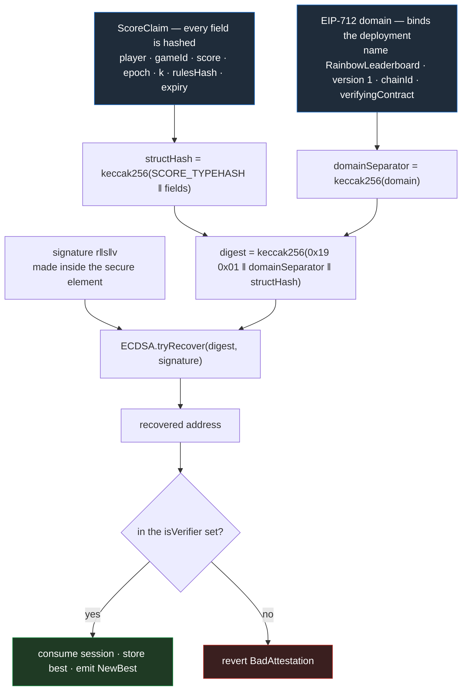

The consequence: **there is no field the player can edit that the digest does not cover.**
Every value the contract acts on — who is credited, how much, which game, which session,
which ruleset, until when — is inside the hash. And the domain separator puts the `chainId`
and this contract's own address in there too, so an attestation is not even portable to a
second deployment of the same code.

### What happens when the player changes the claim

Concretely. The enclave attested `score = 1200`. The player edits the calldata to `999999`
in the browser before signing the transaction.

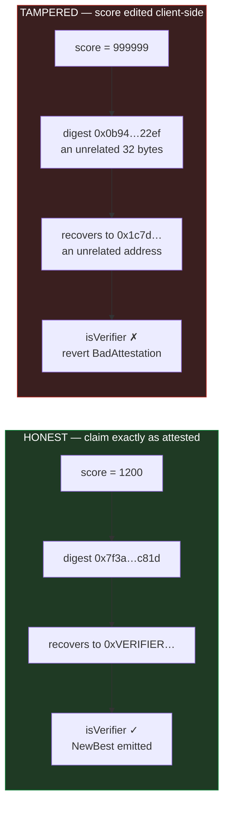

*(Digests illustrative.)* Note what is **not** happening: nothing "detects the tampering."
The contract has no idea a value was changed and holds no notion of an original to compare
against. It hashes what it was given and recovers who signed that hash. One flipped bit
anywhere in the claim changes the digest completely, and the recovered address becomes an
unrelated 20-byte value that nobody ever added to `isVerifier`.

**Why the attacker cannot steer the recovery.** `ecrecover` does not fail on a "wrong"
signature — it cheerfully returns *some* address for almost any `(digest, signature)` pair.
That is precisely why the check is an **allowlist**, not a validity test. To make recovery
land on a registered verifier the attacker would need a signature valid under the verifier's
key over a digest of their choosing. That is forging secp256k1, not editing a transaction.

### Every tamper, and where it dies

| What the player changes | What the contract does | Covered by |
|---|---|---|
| Raises `score` | digest changes → recovers to a non-verifier → `BadAttestation` | `test_rejectsATamperedScore` |
| Swaps `player` for their own address | same — `player` is inside the hash → `BadAttestation` | `test_rejectsSwappingThePlayer` |
| Extends `expiry` past the enclave's TTL | digest changes → `BadAttestation` | `test_rejectsExtendingExpiry` |
| Alters `epoch` or `k` to mint a fresh session slot | digest changes → `BadAttestation`. `sessionId` is *derived* from `(player, epoch, k)` and never submitted, so there is no session field to desynchronise | `testFuzz_sessionIdIsInjective` proves the derivation is injective; the revert follows from the digest |
| Points `gameId` at another board, keeping `rulesHash` | `RulesMismatch`, on the cheap check, before recovery even runs | `test_rejectsAMismatchedRulesHash` |
| Changes `gameId` **and** `rulesHash` together | structurally valid, so it survives the cheap checks and *does* reach recovery — then `BadAttestation`. Only the enclave can mint a valid claim for another board | `test_rejectsRedirectingToAnotherGame` |
| Re-signs the edited claim with their own wallet key | recovers perfectly — to *their* address, which is not a verifier → `BadAttestation` | `test_rejectsASignatureFromANonVerifier` |
| Sends a garbage signature | `ECDSA.tryRecover` returns an error, never a garbage address → `BadAttestation` | `test_rejectsGarbageSignature` |
| Malleates the signature to `(r, n−s)` | OpenZeppelin rejects high-`s` → `BadAttestation`. Harmless even without that guard: replay is keyed on `sessionId`, not on the signature bytes | `test_rejectsAMalleableSignature` |
| Picks the wrong recovery id `v` | recovers to a different address entirely → `BadAttestation` | `test_theWrongRecoveryIdIsRejected` |
| Submits the same untouched attestation twice | first lands, second hits `SessionAlreadyUsed` | `test_rejectsAReplayedSession` |
| Replays an old, lower attestation to overwrite a higher best | `NotAnImprovement` — `best` only ever moves up | `testFuzz_onlyImprovementsEverLand` |
| Submits to a different leaderboard deployment or chain | the domain separator binds `verifyingContract` and `chainId`, so the digest computed there differs → `BadAttestation` | `test_digestIsBoundToThisContractAndChain` |

Every row ends in a revert. The attacker pays gas and changes nothing. Run them with
`forge test` in `contracts/`.

> **When writing new tamper tests, watch the check ordering** (§5). Aim at a **fresh**
> session — a tamper test pointed at an already-spent one returns `SessionAlreadyUsed` and
> never reaches the signature check, so it proves nothing. This bit us once already; see
> `docs/end-to-end.md`.

### Why `msg.sender` is deliberately unconstrained

Credit goes to `claim.player`, which is inside the signature. `msg.sender` is not checked
**at all**.

`Goal.md` originally bound `msg.sender` instead, to stop a third party from submitting
someone else's attestation and being credited for it. Naming `player` explicitly defeats that
attack *directly*, and does it without constraining who pays for the transaction. Leaving the
sender free then buys two real things:

- **Gasless play is a drop-in.** A relayer with a hot key can call `submit` on a player's
  behalf today — no meta-transaction scheme, no contract change, no new trust assumption.
- **The player is never locked out by infrastructure.** They hold a valid signed claim for
  the full TTL. If the tunnel, the relayer or the processor dies *after* attestation, the
  score can still be landed by anyone, from anywhere.

A hostile relayer can **delay** a submission or **censor** it by refusing to send. It cannot
alter the score, redirect the credit, or manufacture an attestation. Front-running someone
else's attestation is not an attack either — it lands the score for its rightful owner and
pays their gas. That is covered by `test_anyoneMayRelay_scoreCreditsThePlayer`.

> **Why the enclave does not submit the transaction itself.**
> A tempting variant is to have the player pay the processor and let the processor send the
> transaction. It buys **no integrity**: it changes *who the sender is*, a value the contract
> deliberately ignores, so it closes none of the rows in the table above. What it adds is
> real — a funded key custodied on a phone whose deployment rotates, nonce management on a
> single-threaded job, an escrow protocol with refunds for the `NotAnImprovement` reverts
> that will be routine, and a hard liveness dependency where today the player holds a
> self-serve proof.
>
> The one thing it *would* change is the denominator problem — an enclave that submits every
> result makes withheld runs impossible. That does not apply to a **highest score** board;
> see the cherry-picking note in §17.
>
> The split as built is the right one: the **enclave is the authority on truth**, the
> **chain is the authority on state**, and the **transport between them is untrusted by
> construction**.

### Where the real risk actually sits

Relaying is sound. The residual risk is not in *who carries* the attestation but in *what the
enclave is willing to attest to* — it replays a log rather than witnessing a performance, and
a perfectly executed input log is a valid input log. See §17.

---

## 7. Setup

### 7.1 Toolchain

```bash
node --version      # 22+ required by pad/cdm
rustup target add wasm32-unknown-unknown
npm i -g @acurast/cli @polkadot-community-foundation/cdm-cli
cdm setup           # installs the Rust/PVM toolchain; npm does NOT
```

> **Two Foundry builds, and you may need both.**
>
> - **Upstream Foundry** (`curl -L https://foundry.paradigm.xyz | bash`) — for `forge test`,
>   `cast`, and `forge create`. This is the [official Polkadot docs](https://docs.polkadot.com/smart-contracts/dev-environments/foundry/) path.
> - **foundry-polkadot** — only if you deploy with `cdm`, because `cdm` shells out to
>   `forge build --resolc`, a flag upstream does not have.
>
> Its installer **overwrites** `~/.foundry/bin/forge`. Install it isolated instead:
>
> ```bash
> export FOUNDRY_DIR="$HOME/.foundry-polkadot"
> mkdir -p "$FOUNDRY_DIR/bin"
> curl -sSfL https://raw.githubusercontent.com/paritytech/foundry-polkadot/master/foundryup/foundryup \
>   -o "$FOUNDRY_DIR/bin/foundryup-polkadot" && chmod +x "$FOUNDRY_DIR/bin/foundryup-polkadot"
> FOUNDRY_DIR="$FOUNDRY_DIR" "$FOUNDRY_DIR/bin/foundryup-polkadot"
>
> # then, ONLY for cdm builds:
> export PATH="$HOME/.foundry-polkadot/bin:$PATH"
> ```

### 7.2 Accounts

You need **three** distinct things funded/authorised, and they trip people up because they
are separate:

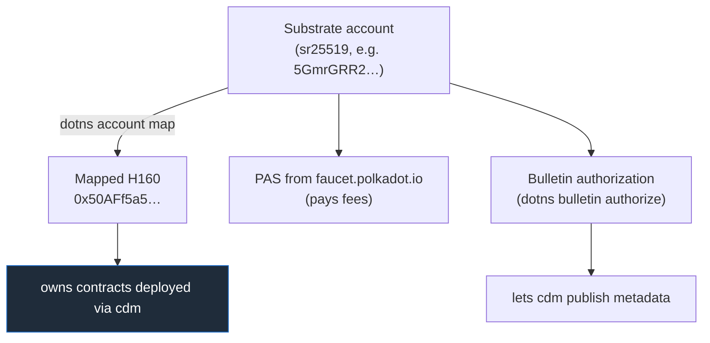

> **A mapped H160 has no private key.** It is derived from your Substrate account. So
> `cast send --mnemonic` will *not* work for owner-only calls on a `cdm`-deployed contract —
> cast derives an Ethereum BIP44 key and signs as a completely different address. See §10.

---

## 8. Part 1 — the simulation

The whole guarantee rests on the sim replaying **identically** everywhere. If the browser and
the enclave disagree by one point, an honest player is flagged as a cheat with no error
anywhere.

```bash
cargo test -p sim                                          # 27 tests
cargo build -p sim-wasm --release --target wasm32-unknown-unknown
cargo run  -p replay --release -- compare --seeds 512      # native vs wasmi
cargo run  -p replay --release -- export  --seeds 48
node harness/run-node.mjs                                  # wasmi vs V8
cargo run  -p replay --release -- selftest                 # NEGATIVE CONTROL
```

Rules that make this work, enforced structurally rather than by convention:

| Rule | How it is enforced |
|---|---|
| No I/O, no wall-clock, no `HashMap` | `#![no_std]` — they are unreachable |
| No floating point | fixed-point 16.16 throughout |
| Pinned RNG | PCG32 written **in-tree**, no `rand` dependency |
| No pointer-width-dependent state | no `usize` in `State`, asserted by a test |
| Fixed timestep | `step()` takes no delta — the tick count *is* the clock |

> **Why not `rand::SmallRng`?** It is explicitly not reproducible across versions, and has
> historically picked a different algorithm by pointer width — exactly the wasm32 (32-bit)
> versus aarch64 (64-bit) split this system spans.

> **Always run `selftest`.** A harness that only ever prints PASS looks identical whether it
> is checking carefully or not checking at all. `selftest` injects a known one-bit fault and
> asserts the detector finds it, at the right tick.

---

## 9. Part 2 — the contract

### 9.1 Test

```bash
cd contracts
forge install OpenZeppelin/openzeppelin-contracts@v5.4.0 --no-git
forge install foundry-rs/forge-std@v1.11.0 --no-git
forge test          # 34 tests, every reject path
```

### 9.2 Deploy

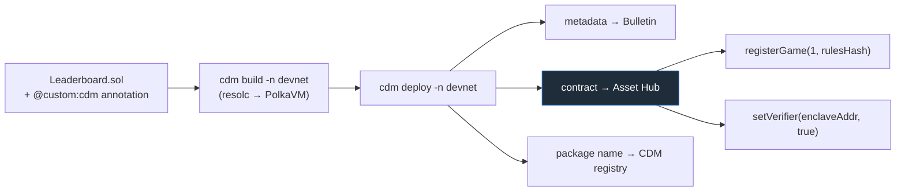

The CDM package name comes from a NatSpec annotation on the contract itself:

```solidity
/// @custom:cdm @dw3labs/rainbow-leaderboard
contract Leaderboard is EIP712, Ownable { … }
```

```bash
export PATH="$HOME/.foundry-polkadot/bin:$PATH"
cd contracts
cdm build  -n devnet
cdm deploy -n devnet --bulletin-url wss://bulletin-paseo-02.tservices.es:9443
```

> **`cdm deploy` passes NO constructor arguments.** A contract with a non-empty constructor
> receives nothing and reverts with `Revive.ContractReverted`. Design for a **zero-argument
> constructor** plus owner-only setters — and validate anyway, so a misconfiguration is a
> clean revert instead of a permanently broken contract.

> **Package names are permanent and global.** The registry is append-only. And `cdm` with no
> configured account signs as **Alice, silently** — the name is then hers forever. Check
> `~/.cdm/accounts.json` before your first deploy.

> **Bulletin publish can time out** at 300s. That is usually the endpoint, not your
> authorization — check with `dotns bulletin status <ss58> --env devnet` and retry with a
> different `--bulletin-url`. Note the contract deploys *before* metadata, so a timeout can
> orphan a deployed-but-unregistered contract.

### 9.3 Configure

`rulesHash` is the hash of the simulation binary itself:

```bash
RULES=$(node -e '
  const {keccak_256}=require("@noble/hashes/sha3.js");
  const b=require("fs").readFileSync("target/wasm32-unknown-unknown/release/sim_wasm.wasm");
  console.log("0x"+Buffer.from(keccak_256(b)).toString("hex"))')

node scripts/revive-call.mjs --to $CONTRACT \
  --data "$(cast calldata 'registerGame(uint64,bytes32)' 1 $RULES)"
```

---

## 10. Owner calls — the part that surprises everyone

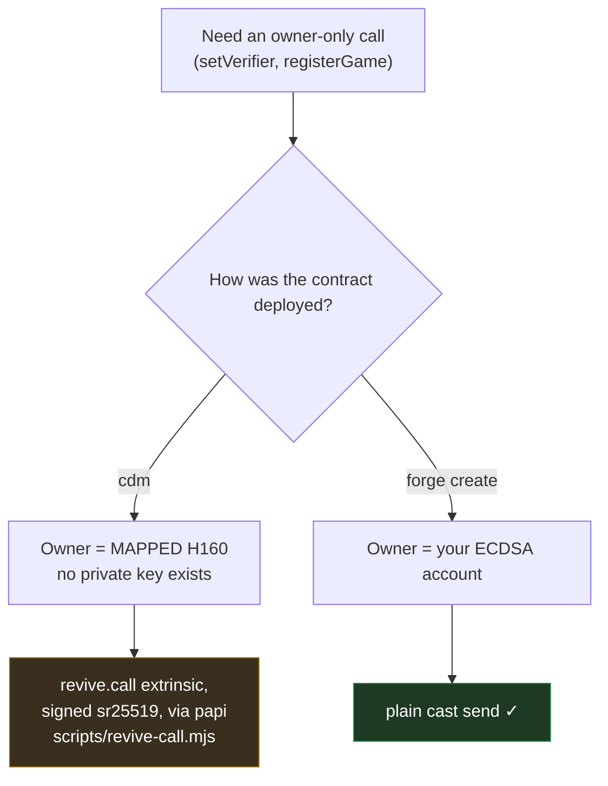

```bash
# reads work with any Ethereum JSON-RPC client
cast call $CONTRACT "best(uint64,address)(uint64)" 1 0xPLAYER \
  --rpc-url https://paseo-assethub-rpc.laissez-faire.trade

# owner writes on a cdm-deployed contract
node scripts/revive-call.mjs --to $CONTRACT \
  --data "$(cast calldata 'setVerifier(address,bool)' 0xVERIFIER true)"
```

> **`@polkadot/api` cannot sign for this chain.** It builds extrinsic version 4; Asset Hub
> Paseo expects newer, and the runtime *panics while decoding* —
> `wasm 'unreachable' instruction executed` inside `TaggedTransactionQueue_validate_transaction`.
> It reads like a bad contract call, but it **reproduces on `system.remark`**, which is what
> proves it is the client. Use **polkadot-api (papi)**, as `dotns` does.

---

## 11. Part 3 — the verifier enclave

The verifier is a small Node job that bundles `sim.wasm` and a vendored keccak256 — 52 KB
total, comfortably under the ~1 MB IPFS ceiling for an Acurast bundle.

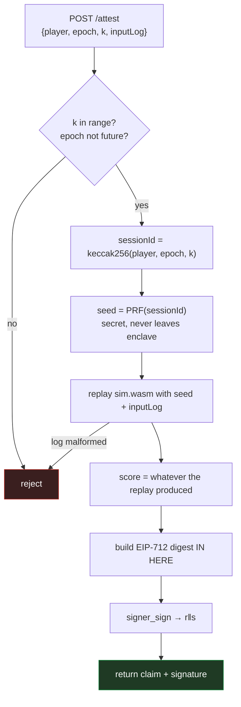

**Four rules the enclave must never break:**

1. **No score is accepted.** `/attest` has no score field at all — it can only be computed.
2. **The digest is built inside.** Signing a caller-supplied digest would let anyone get
   anything signed.
3. **`rulesHash` is computed from the loaded artifact**, not configured, so the enclave
   cannot attest for a ruleset it is not running.
4. **The seed cannot be computed outside.**
   `seed = keccak256(signer_sign("rainbow-seed-v1" ‖ sessionId))`. `signer_sign` is
   deterministic (RFC 6979) and its key is in the secure element, so this is a PRF the
   player cannot evaluate offline. The seed *is* released by `/session` — the level is
   generated from it, so the client cannot play without it — but only for the current
   epoch and only for `k < maxSessionsPerEpoch`. See "Why the seed is handed out at all"
   above.

### Deploy it

```bash
cd e2e/acurast-verifier
# .env: ACURAST_MNEMONIC, CONTRACT, CHAIN_ID, GAME_ID, WEBHOOK_URL
acurast estimate-fee rainbow-verifier    # validates config BEFORE spending
acurast deploy rainbow-verifier
```

Key config, and why:

```jsonc
"runtime": "Shell",                     // Node.js runtime CANNOT do EIP-712 — see below
"assignmentStrategy": {
  "type": "Single",                     // "Competing" rotates processors → rotates keys
  "instantMatch": [{"processor": "<SS58>", "maxAllowedStartDelayInMs": 10000}]
},
"usageLimit": {"maxMemory": 2000, "maxNetworkRequests": 10, "maxStorage": 10000},
"mutability": "Mutable"                 // required if you later use reuseKeysFrom
```

> **The runtime choice is load-bearing.** On the **Node.js** runtime,
> `_STD_.chains.ethereum.signer.sign` force-prepends `"acusig" ‖ SCRIPT_HASH` before hashing,
> so an EIP-712 digest could never be recovered by the contract. The **Shell/Cargo** runtime's
> `signer_sign` signs the bytes you give it, with no envelope. Use `Shell`.

> **`usageLimit` is a requirement, not a cap.** It is matched against what the processor
> *advertises*; ask for more than the device offers and it becomes ineligible. And the units
> are not bytes — `networkRequestQuota` is a `u8`, so it is a *count*. Check the device's
> advertised values first.

> **`instantMatch` skips the lottery.** Without it you are competing for public processors,
> which is what strands most first deployments at "finding the processor". It also skips the
> ~4.5 h warmup for a freshly onboarded device.

---

## 12. Part 4 — wiring them together

This is the step that makes the trust story real.

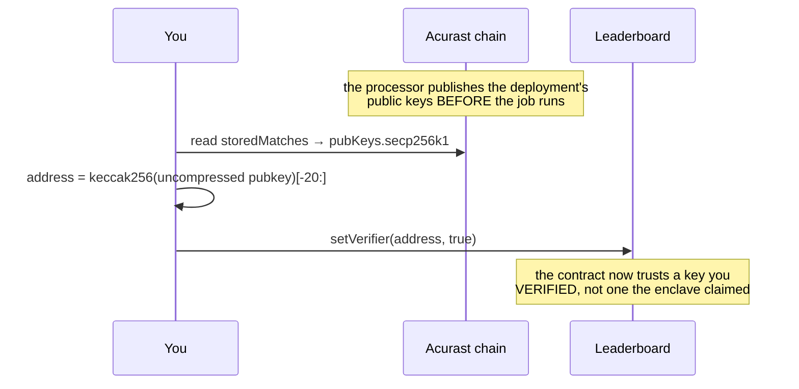

```bash
# 1. read the enclave's key from Acurast chain state (not from the enclave!)
#    acurastMarketplace.storedMatches → assignment.pubKeys.secp256k1

# 2. register it
node scripts/revive-call.mjs --to $CONTRACT \
  --data "$(cast calldata 'setVerifier(address,bool)' 0xafbd70f7… true)"

# 3. run the whole flow
node scripts/attest-and-submit.mjs \
  --verifier https://<tunnel> --expect-verifier 0xafbd70f7… --player 0x… --k 0
```

> **Keys are per deployment.** Every redeploy mints a new verifier address unless you use
> `reuseKeysFrom`. Keep `isVerifier` a **set** and *add without removing*, so attestations
> already in flight stay valid until they expire.

---

## 13. Part 5 — the signature detail that will cost you a day

Acurast's `signer_sign` returns **64 bytes** (`r‖s`) with **no recovery id**.
`ECDSA.recover` needs **65** with `v ∈ {27, 28}`.

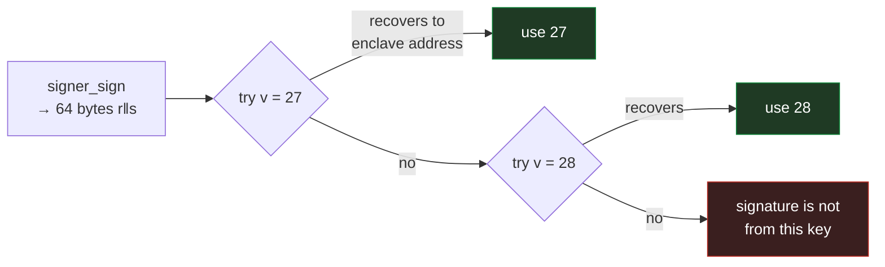

```js
for (const rec of [0, 1]) {
  const packed = new Uint8Array(65);
  packed[0] = rec; packed.set(rs, 1);
  const pub = secp256k1.recoverPublicKey(packed, digest, {prehash: false});
  if (addressOf(pub) === enclaveAddress) { v = 27 + rec; break; }
}
```

Use the contract's `scoreDigest(claim)` as the **single source of truth** for what to sign.
Do not reimplement the EIP-712 encoding on the job side and hope it matches — verify it does,
before deploying:

```bash
# enclave's digest, computed locally against a mock bridge
# vs the deployed contract's:
cast call $CONTRACT "scoreDigest((address,uint64,uint64,uint64,uint32,bytes32,uint64))(bytes32)" \
  "($PLAYER,1,$SCORE,$EPOCH,$K,$RULES,$EXPIRY)" --rpc-url $RPC
```

---

## 14. Part 6 — the game, and shipping it as a Product

The client is a **React + Vite + PixiJS v8** app in `app/`, published to the Products
Devnet as a static bundle.

### The rule the client must not break

The client never implements a game rule. It steps `sim.wasm` and draws what comes back.
A JavaScript reimplementation of the physics would be a second ruleset, it would drift,
and honest players would start being flagged as cheats. `app/src/sim/sim.ts` is the whole
interface: `sim_create` → `sim_step_one` → `sim_snapshot`.

**React does not own the loop.** It owns the chrome; PixiJS owns the play surface and is
driven imperatively. Reconciling a scene graph at sixty ticks a second would put a diffing
pass inside a fixed-timestep loop that has to stay exact — the tick count *is* the clock the
enclave replays against. React sees a 10 Hz HUD sample, never a frame.

**The tick convention is load-bearing.** An input change is stamped with the number of steps
already taken and pushed *before* stepping, matching `replay_with`. Get this off by one and
nothing looks wrong — the game plays perfectly and only the attestation disagrees.

### What the sandbox allows

Everything here rests on [E0.1](E0.1-product-sandbox.md), which measured a Product's sandbox
before any of it was built:

| Capability | Result | Consequence |
|---|---|---|
| `WebAssembly.instantiate` | PASS | `sim.wasm` runs client-side — no fallback existed if it had not |
| Third-party HTTPS fetch | PASS | the app calls the enclave tunnel directly; no relay needed |
| WebGL2 | PASS | PixiJS v8 is viable |
| `SharedArrayBuffer` | absent | rules out threaded engine targets; PixiJS does not need it |

The renderer therefore requests `preference: "webgl"` explicitly rather than letting PixiJS
prefer WebGPU, which was never measured in the sandbox.

### Detecting the host

A Product gets its signer and chain RPC from the host. Outside one, `ProductSDKProvider`
throws `Host storage unavailable` — and since it sits above the whole tree, that takes the
game down with it.

`app/src/SdkGate.tsx` **does not ask**. It calls `createApp` and treats only its rejection as
absence, because the failure is asymmetric: a false negative is silent and permanent — the app
quietly drops its one privileged capability and nothing looks broken — while a false positive
is immediate and legible.

> **Two predicates were tried and both were wrong in the expensive direction.** The first
> inferred from `window.self !== window.top`, reasoning that a Product is delivered into a
> cross-origin iframe — which E0.1 did measure, but only on the *web gateway*. **Polkadot
> Desktop loads the app top-level**, so it reported "no host" inside a real host and silently
> disabled submitting. The second asked `isInsideContainer()`, which outside an iframe is one
> synchronous look for a marker the host injects; asked once on mount, that is a race.

There is no error boundary around the children either. The old one caught *anything* thrown in
the subtree and reported it as "no host", which is how a chain-support error came to look like
a missing host for as long as it did.

Without a host the app still plays and still gets scores attested; only the on-chain submit is
unavailable. In a **dev build** a `DevProvider` fallback supplies dev accounts so `npm run dev`
is useful — it is gated on `import.meta.env.DEV` and a published Product contains no
construction of it at all, for reasons set out in
[host API conformance](host-api-conformance.md).

### Three tiers, and what each one may do

Two switches decide what a run is: whether a wallet is connected, and where the enclave
answers from. Their consequences used to be spread through `Play.tsx` as a scattering of
`if (simulating)` and `if (!player)` checks, which is survivable with two combinations and
not with three. `app/src/chain/mode.ts` enumerates them instead, and everything downstream
asks it rather than re-deriving:

| Tier | Identity | Enclave | Submits | Slot |
|---|---|---|---|---|
| `guest` | none — a placeholder | in this tab | no | `.guest` |
| `practice` | connected wallet | in this tab | no | `.sim` |
| `live` | connected wallet | deployed Acurast job | yes, with a host | *(none)* |

**Capability comes only from the tier.** There is no path where a caller assembles its own
combination. "Guest, but against the real verifier" would burn one of that address's twelve
attempts an hour to obtain a seed for a run nobody can ever submit; "simulated, but
submitting" would ask the contract to accept a signature from a key printed in this
repository. Neither state is reachable because neither is enumerated.

**A guest is not an error state.** Someone who opens the app with nothing connected gets the
in-tab enclave and plays — the whole machine, steps 1–5, with no wallet and no deployed job.
That is what the tier is for. The simulator switch is deliberately not consulted for them.

**The guest address is a constant**, `0x6775657374…` — `guest` in ASCII, rest zeroed:

```ts
export const GUEST_PLAYER = "0x6775657374000000000000000000000000000000";
```

Some address has to exist, because `sessionId` is `keccak256(player, epoch, k)` and both
`mock.ts`'s `check()` and the deployed verifier reject anything that is not
`/^0x[0-9a-fA-F]{40}$/`. Nothing requires it to be unique. An earlier version minted a random
one per browser, which bought a per-guest level and a per-guest character and cost something
worth more than both: a generated `0x…` rendered under the heading "Account" is
indistinguishable from a wallet, and a guest reading it has been told something false about
what they hold. The consequence of the constant, stated plainly, is that **every guest in a
given hour plays the same level at the same attempt index**. For a tier whose purpose is to
show the machine working, that is a fair trade.

Nothing shows a guest an address. The Session panel says `Guest — no account, nothing can be
submitted`, and step one of the trace diagram says `Account · not connected`, which is the
true statement about the step that has not happened.

**Sessions and runs are separated per tier**, by the `slot` suffix above. A seed the simulator
issued means nothing to the deployed one, and a guest's means nothing to either; replaying one
against another produces a score mismatch that looks exactly like a cheat. Changing tier
switches the held session and the run list together, never one without the other.

`resolveMode` is pure and total — it touches no storage and no clock — so the whole domain is
eight states and `mode.test.ts` enumerates all of them. The invariants worth knowing are there
rather than here: only `live` can ever submit, a guest is always pinned to the in-tab enclave,
every tier gets a distinct slot, and a refusal always carries a reason.

> **What is *not* checked is individual movement.** The input log carries no identity, in any
> tier. Identity binds one level up and more strongly: the seed derives from the address, so
> the level itself is a function of who is playing, and `attest` re-derives
> `sessionIdFor(player, epoch, k)` rather than trusting any seed it is handed. A log recorded
> on one player's level, replayed under another's, runs against a different level entirely.
> And the enforcement that matters is not in the client at all — a simulated attestation is
> signed by a key the contract's `isVerifier` set does not contain, so the contract rejects it
> whatever the UI believes. `mode.canSubmit` is convenience; the verifier set is the guarantee.

### Working without an enclave

An Acurast job is a *onetime* execution, and behind a quick tunnel its hostname is minted at
boot and dies with the job — so the verifier URL baked into `Play.tsx` is stale the moment
that job ends, and redeploying to change one line of UI is a poor loop. (A named tunnel
fixes the churn but not the loop: set `VITE_VERIFIER_URL` at build time and the default
points at a hostname that outlives any one job. See `e2e/acurast-verifier/.env.example`.)
`npm run dev` therefore offers **Simulate the enclave**, a switch in the Session panel that
replaces the deployed verifier with `app/src/chain/mock.ts`, running in the tab. It is not the
only way in: the trace diagram offers **Simulate here** whenever the Processor is measured
offline, and the `guest` tier uses the same module without asking.

It is a second implementation of `verifier.mjs`, deliberately faithful: the same
`sessionIdFor`, the same `keccak256(sign("rainbow-seed-v1" ‖ sessionId))` seed derivation, a
replay through `sim_verify` on its **own** wasm instance — not the one the player just
played on — and the same EIP-712 digest. `rulesHash` is hashed from the bytes it actually
loaded. Steps 1–5 of the proof rail work end to end with nothing deployed.

What it is not is a verifier. Its key is derived from a string in the source, so anyone can
sign anything with it; the contract's `isVerifier` set does not contain it. Two guards keep
that from becoming confusing rather than obvious:

- **It never submits.** `finish()` stops after attesting and says why — one gate, on
  `mode.canSubmit`. Step 6 stays idle, because the simulator cannot honestly reach it.
- **Sessions do not cross over.** Simulated runs are held under `rainbow.session.sim`, apart
  from both `rainbow.session` and the guest slot — see the tier table above.

The switch is gated on `import.meta.env.DEV` (`ui/Settings.tsx`), but the module behind it is
not: the gate on the simulator itself was removed deliberately, so a player arriving at a dead
Processor can still see the game. `chain/mock.ts` therefore ships, as its own chunk behind a
dynamic `import()` — downloaded only when the simulator is switched on, so it stays off the
critical path and off the byte quota below for everyone who never asks for it. What keeps it
honest is its key, which is printed in this repository and is not in the contract's
`isVerifier` set, so a simulated attestation can never be submitted.

### Choosing the network

One flag decides three things that must never be chosen separately — the Asset Hub the
contract lives on, the Bulletin chain Cloud Storage talks to, and the contract address:

```bash
npm run build                                  # devnet (default)
VITE_NETWORK=paseo VITE_CONTRACT=0x… npm run build
VITE_NETWORK=polkadot VITE_CONTRACT=0x… npm run build   # Cloud Storage off: no Bulletin yet
```

`src/chain/network.ts` owns it and `vite.config.ts` reads the same variable to decide which
chain metadata to keep, so what the app asks for and what it ships metadata for cannot
drift. Only devnet has a recorded contract address; the others require `VITE_CONTRACT` and
fail loudly at startup without it, rather than sending transactions to an address that
means nothing on that chain.

> **`createApp`'s `cloudStorage.environment` defaults to `paseo`, and that default cost a
> day.** This Product runs on the Devnet, whose Bulletin is a *different chain*. Polkadot
> Desktop does not support Paseo Bulletin, so `createApp` rejected with
> `ChainNotSupportedError: Chain 0x8cfe6717… is not supported by the current host` — which
> the SDK gate then reported as **"no host"**, silently disabling on-chain submitting while
> the game and the enclave round-trip kept working. A player got an enclave-signed
> attestation and was told to go and land it from a CLI.
>
> Asset Hub was correct throughout and was never implicated. The
> [official docs](https://docs.polkadotcommunity.foundation/getting-started/developers/)
> warn that the usual form is *silent* — "your data is simply not where you expect it and
> nothing errors". We only got a loud failure because Desktop declines the chain outright.
>
> Two lessons are baked into `SdkGate.tsx`. **Never predict whether a host exists** — two
> versions gated on a predicate (`window.self !== window.top`, then `isInsideContainer()`)
> and both were wrong in the silent direction; call `createApp` and treat only its
> rejection as absence. And **never let an unused service take down a needed one**: if
> Bulletin is refused, the gate retries with `cloudStorage: false` and warns, rather than
> losing the signer.

### Publishing

```bash
cd app
npm run build                     # sync-wasm → tsc → vite build, emits dist/
pad ./dist <name>.dot --env devnet --mnemonic "$MNEMONIC"
```

> **`pad` ignores the `MNEMONIC` environment variable** despite its own `--help` offering it.
> It falls back to a dev worker account and then fails with
> `Domain <name>.dot is already owned by 0x…`, which reads like an ownership problem and is
> really a signing-identity one. Pass `--mnemonic` explicitly.

> **The gateway serves a resolver shell, so `curl` cannot verify a deploy.** Both `/` and
> `/sim.wasm` return the same ~20 KB HTML; resolution happens client-side through a
> service-worker VFS into a sandboxed iframe. Open it in a browser to check.

**Bundle size is a quota, not a fee.** Bulletin storage is authorization-based — this
deployment's account holds 20 MB. The SDK reaches every supported chain through dynamic
imports, so Rollup emitted metadata for Kusama, Polkadot, Paseo and Individuality too:
6 MB of the 7.1 MB build, for chains the app never connects to. `vite.config.ts` stubs the
unused ones, taking the bundle to **3.1 MB** — the difference between two deploys and six.
Check the quota with `dotns bulletin status <ss58> --env devnet`.

---

## 15. Live reference

| | |
|---|---|
| Contract | `0x891548f5268FA27B68553eb4841f9246b38A16fA` |
| CDM package | `@dw3labs/rainbow-leaderboard` |
| Chain | Paseo Asset Hub, EVM chain id `420420417` |
| ETH-RPC (reads) | `https://paseo-assethub-rpc.laissez-faire.trade` |
| Substrate RPC (writes) | `wss://asset-hub-paseo-rpc.n.dwellir.com` |
| Owner | `0x50AFf5a51BE03d5914D9b5A42c548Dc35A73f7D8` |
| `epochSeconds` / `maxSessionsPerEpoch` | 3600 / 12 |
| Game 2 `rulesHash` | `0x02bdb80f…bd049b` = `keccak256(sim.wasm)` — the platformer, and the only board registered here |
| `sim.wasm` (game 2) | 33,599 bytes, ABI version 2 |
| Product app | `rainbow-dev.dot` — https://rainbow-dev.dev-dot.li |
| App bundle CID | **not yet published under this name.** `bafybeigw5zxqdeqdwklpttxxbzqa325u47exxcyahz7yz76cw6gqycf6d4` (2026-07-30, block 11596472) is bound to the previous `dw3labsgame.dot` |
| Network flag | `VITE_NETWORK` — `devnet` (default), `paseo`, `polkadot` |
| Verifier | `https://rainbow-verifier.dw3labs.work` — baked in as the default |
| Registered verifier | `0xce0d7dfaf3b8d377ced5ba25cb47f26d192e75d2` (Acurast `380403`; reused unchanged by `380404`, `380405`, `380406`) |

> **A new ruleset is a new `gameId`, never a mutated hash.** `gameRules` is write-once by
> design (defect D3): scores earned under one set of physics must not share a board with
> scores earned under another.
>
> Game 1 (`0x229be8b7…`, the falling-orb strawman) lives on the **previous** deployment
> `0x9cc62a70…` and is not registered on this one — no verifier serves that ruleset any more.
> Retiring a ruleset never needed a redeploy; adding the board's enumeration did. See
> [deployment-devnet.md](deployment-devnet.md).

---

## 16. Troubleshooting

| Symptom | Cause |
|---|---|
| `unexpected argument '--resolc'` | upstream Foundry; `cdm` needs foundry-polkadot |
| `Revive.ContractReverted` on deploy | constructor takes arguments; `cdm` passes none |
| `OwnableUnauthorizedAccount(0x…)` | `cast` signing as a BIP44 key, not your mapped H160 |
| `wasm 'unreachable'` in `validate_transaction` | `@polkadot/api` building extrinsic v4 — use papi |
| `Incompatible runtime entry Tx(Revive.call)` | papi field names — `weight_limit`, `dest` as hex string, `data` as `Uint8Array` |
| Acurast job stuck "finding the processor" | no `instantMatch`, or `usageLimit` exceeds what the device advertises |
| Acurast job dies silently | No channel before curl installs. Bound apt, post a `preflight` line, and check the sink — see [E0.3/E0.4](E0.3-E0.4-acurast.md). CLI 0.10 also prints a Canary DevTools view key now, though whether it streams is unverified. |
| App says "no host" inside Polkadot Desktop | Almost never a missing host. `createApp` rejected — most likely `cloudStorage.environment` defaulting to `paseo` and the host declining Paseo Bulletin. Check the console for the real error. |
| `ChainNotSupportedError: Chain 0x8cfe6717…` | That is **Paseo Bulletin**. Pass `cloudStorage: { environment: "devnet" }` (or set `VITE_NETWORK`). |
| Attestation valid but the app will not submit | The signer comes from the host; no host means no submit. Fix the `createApp` failure rather than reaching for `scripts/serve-game.mjs`. |
| `apt` exits 100 in the proot | `TMPDIR` leak — `export TMPDIR=/tmp` first |
| `cp X X failed` in the job | the bundle extracts to `/root/app`, which **is** `$HOME/app` |
| `rulesHash` changed after a comment-only edit | `overflow-checks = true` bakes panic `file:line:col` into the binary, so **adding a comment to `crates/sim` shifts line numbers and changes the artifact**. See below. |

### Editing `crates/sim` after a game is registered

`rulesHash` is `keccak256(sim.wasm)`, and the release profile sets `overflow-checks = true`.
Overflow checks emit panic metadata carrying the **source line and column**, so the compiled
bytes depend on the *layout* of the source, not just its behaviour. A reformatting, a new
comment, or a clippy autofix such as `tx < 10 || tx >= N` → `!(10..N).contains(&tx)` all
change the artifact — one of those was measured moving it by a single byte, another kept the
length identical and changed the contents.

Once a `gameId` is registered this is no longer cosmetic: the source must keep reproducing
the exact artifact the enclave bundles and the contract is pinned to. Verify before
committing any change to that crate:

```bash
cargo build -p sim-wasm --release --target wasm32-unknown-unknown
node -e 'const{keccak_256}=require("./scripts/node_modules/@noble/hashes/sha3.js");
  console.log("0x"+Buffer.from(keccak_256(
    require("fs").readFileSync("target/wasm32-unknown-unknown/release/sim_wasm.wasm"))).toString("hex"))'
# must equal gameRules(2) on-chain
```

If a change to the rules is genuinely wanted, it is a **new `gameId`**, not a new hash for
the old one.
| Revert `0x36177dda` / `0xdafa9c74` / `0x342bd384` | `SessionAlreadyUsed` / `NotAnImprovement` / `BadAttestation` |

---

## 17. What this does **not** solve

Stated plainly, because a security design that overclaims is worse than one that admits its
edges.

- **Bots and TAS-quality play.** A perfectly executed input log is a *valid* input log.
  Behavioural heuristics inside the enclave are detection, not proof, and an arms race.
- **Sybil.** Nothing stops one human farming many accounts. The Products **personhood
  precompile** is the identified path if the board ever carries value.
- **Hardware attacks on the TEE.** Trust is inherited from the chip vendor's attestation root.
- **Operator device selection.** Using the public processor market instead of your own fleet
  is what removes this.
- **Cloudflare in the path.** Liveness and censorship dependency, not an integrity one.
- **Seed PRF reuses the attestation key.** Domain-separated so it cannot be coerced into
  producing an attestation, but a `derivationPath`-derived key would be cleaner.

**Explicitly not a threat: cherry-picking.** A player choosing which runs to submit is
harmless for a *highest score* board — a withheld run is indistinguishable from a run that
never happened. This would **not** hold for win rates, ELO or tournament records, where the
denominator matters; those need enclave-submitted results rather than player-relayed ones.

---

## 18. The strongest thing still unbuilt

Publish the **input log to Bulletin** alongside each score.

The log fully determines the run, so anyone could re-replay it and check the score
independently. That changes the claim from *"trust the TEE"* to *"the TEE is a fast path over
a publicly re-verifiable record"* — and it comes with ghost replays, spectating and dispute
resolution as side effects.

---

## Further reading

| Document | Contents |
|---|---|
| `docs/E0.2-determinism.md` | cross-target determinism evidence |
| `docs/E0.1-product-sandbox.md` | what a Polkadot Product may do in its sandbox |
| `docs/E0.3-E0.4-acurast.md` | `signer_sign` semantics, tunnel |
| `docs/deployment-devnet.md` | deployment specifics, `cdm` vs `forge create` |
| `docs/end-to-end.md` | the working run, with negative tests |
| `docs/host-api-conformance.md` | every chain call, and the host call it makes |
| `contracts/README.md` | contract design, D1/D3 rationale |
| `Goal.md` | the original design document |
